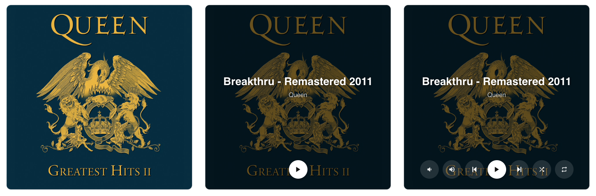

[](https://www.home-assistant.io/)
[](https://github.com/hacs/integration)

# Cover Media Card: Home Assistant media player card

> [!NOTE]
> This card is vibe coded

A Home Assistant Lovelace card that turns your media players into a full-bleed cover art display. Controls stay out of the way until you need them.



---

## Features

- **Cover art background**: artwork fills the entire card. Choose `fill` (default, crops to fit) or `fit` (fully visible with blurred background). Aspect ratio follows the cover art, clamped to configurable min/max bounds.
- **App logo fallback**: when no cover art is available, the card shows an app logo (e.g. Netflix, Youtube) if the player reports an `app_name`.
- **Auto-hiding overlay**: track title, artist, and controls fade out after a configurable timeout. Tap to show them, or they reappear automatically on track change.
- **Multi-player tabs**: configure multiple media players and switch between them with a tap.
- **Visual editor**: players, buttons, and settings are all configurable without YAML. Buttons and players can be reordered by drag-and-drop.

With YAML you can also configure:

- **Per-player buttons**: use a different button set for each player.
- **Conditional visibility**: show or hide any button or player tab based on entity state.

---

## Installation

[](https://my.home-assistant.io/redirect/hacs_repository/?owner=klaptafel&repository=ha-cover-media-card&category=plugin)

1. Go to **HACS** → three-dot menu → **Custom repositories**.
2. Enter `https://github.com/klaptafel/ha-cover-media-card`, category **Dashboard**, click **Add**.
3. Find **Cover Media Card** and click **Download**.

---

## Configuration

The visual editor covers the most common setup: adding players, selecting buttons, and adjusting overlay behavior. Advanced options (per-player buttons and conditional visibility) require YAML.

### Minimal

```yaml
type: custom:cover-media-card
players:
  - media_player.living_room
```

### Options

| Option | Default | Description |
|---|---|---|
| `players` | required | One or more media players. |
| `buttons` | `[play_pause, power]` | Buttons to show, in order. |
| `ratio_min` | `16:9` | Most landscape the card can get. |
| `ratio_max` | `9:16` | Most portrait the card can get. Set equal to `ratio_min` for a fixed ratio. |
| `art_style` | `fill` | `fill` crops art to fill the card. `fit` shows art fully with a blurred background. |
| `auto_hide` | `true` | Auto-hide the overlay when media is playing. |
| `show_duration` | `10` | Seconds before the overlay hides. |
| `show_on_change` | `true` | Show the overlay when the track changes. |
| `volume_step` | `2` | Volume step in percent. |
| `auto_switch` | `0` | Seconds to wait before switching to a player that starts playing. `0` disables auto-switch. |

### Built-in buttons

`play_pause` `previous` `next` `volume_up` `volume_down` `shuffle` `repeat` `power` `group`

The `group` button is hidden by default. To enable it, open a player in the editor and add one or more group members. Tapping the button joins all listed players; tapping again unjoins them. Works best between speakers of the same brand.

### Custom buttons

Add a button with any MDI icon and HA tap action:

```yaml
type: custom:cover-media-card
players:
  - media_player.living_room
buttons:
  - play_pause
  - power
  - icon: mdi:netflix
    label: Open Netflix
    tap_action:
      action: perform-action
      perform_action: media_player.select_source
      data:
        source: Netflix
      target:
        entity_id: media_player.living_room
```

Supports any [HA tap action](https://www.home-assistant.io/dashboards/actions/).

---

## Advanced

### Per-player buttons

Override the button set for a specific player using `buttons` on a player entry:

```yaml
type: custom:cover-media-card
players:
  - entity: media_player.living_room
    name: Living Room
  - entity: media_player.tv
    name: TV
    buttons:
      - play_pause
      - power
```

### Visibility

Show or hide buttons or player tabs based on any entity state. Visibility accepts a list of conditions: all must be true.

**Show a player tab only when a switch is on:**

```yaml
type: custom:cover-media-card
players:
  - entity: media_player.living_room
    name: Living Room
  - entity: media_player.kitchen
    name: Kitchen
    visibility:
      - condition: state
        entity: switch.kitchen_active
        state: "on"
```

**Show a button only while media is playing or paused:**

```yaml
type: custom:cover-media-card
players:
  - media_player.living_room
buttons:
  - play_pause
  - icon: mdi:netflix
    label: Open Netflix
    visibility:
      - condition: state
        entity: media_player.living_room
        state:
          - playing
          - paused
    tap_action:
      action: perform-action
      perform_action: media_player.select_source
      data:
        source: Netflix
      target:
        entity_id: media_player.living_room
```

Available condition types:

| Condition | Key fields |
|---|---|
| `state` | `entity`, `state` or `state_not` (single value or list) |
| `numeric_state` | `entity`, `above`, `below`, optional `attribute` |
| `attribute` | `entity`, `attribute`, `value` |
| `and` | `conditions: [...]`; all must be true |
| `or` | `conditions: [...]`; at least one must be true |

Time-based conditions are not supported. Use a [template binary sensor](https://www.home-assistant.io/integrations/template/) to expose time-based logic as an entity state.

### Hiding the overlay

The overlay (dark background, track info, and controls) can be hidden using [Card Mod](https://github.com/thomasloven/lovelace-card-mod):

```yaml
card_mod:
  style: |
    ha-card {
      --cover-media-overlay-display: none;
    }
```

---

## App logos

When a media player has no cover art but reports an `app_name`, the card automatically shows a logo from the [`apps/`](https://github.com/klaptafel/ha-cover-media-card/tree/main/apps) folder. The app name is slugified (lowercased with non-alphanumeric characters removed) to determine the filename:

| App name | File |
|---|---|
| Netflix | `apps/netflix.png` |
| Spotify | `apps/spotify.png` |
| Apple TV | `apps/appletv.png` |

To add a logo for an app, open a pull request with a **500×500px PNG** in the `apps/` folder.
